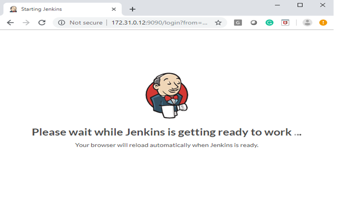
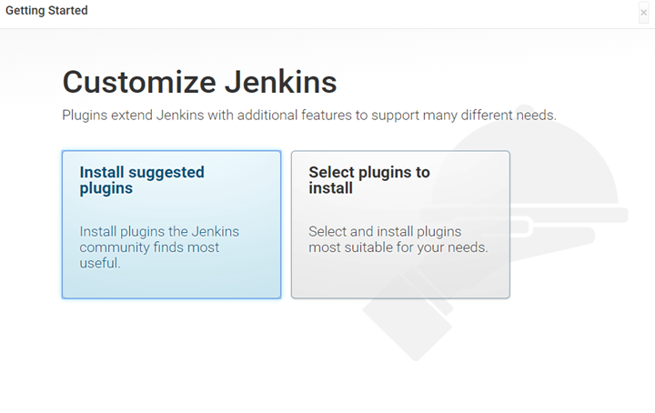
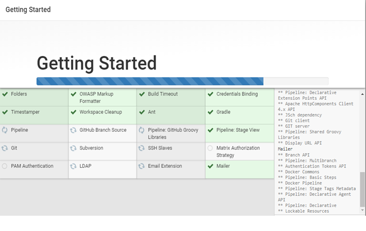
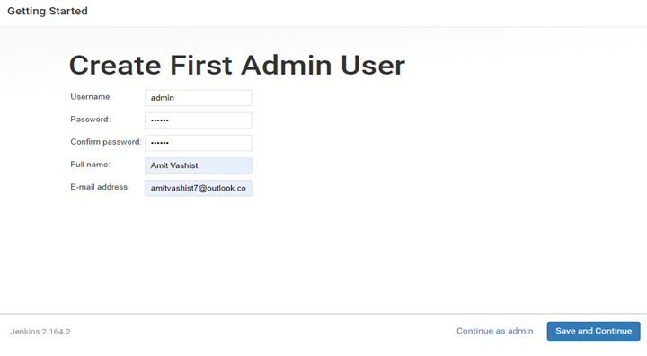
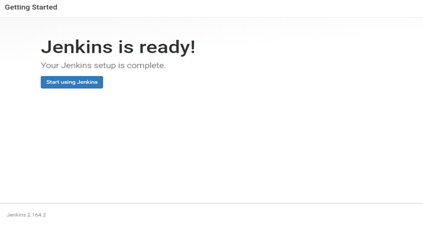

# Install CI/CD Tools - Jenkins. 

## Download Jenkins WAR File. 
```
wget https://get.jenkins.io/war-stable/2.263.1/jenkins.war
```

## Jenkins Required Java JDK as dependency. 
```
apt-get update; apt-get install default-jdk -y
java -version 
```

## Start the Jenkins on Port 9090
```
java -jar jenkins.war --httpPort=9090 & 
```

Note: One you go the message on your screen that : "Jenkins is Up & running"

## Access Jenkins from your web browers: "172.31.0.100:9090"


## Now unlock the Jenkins via initialpassword
```
This may also be found at: /root/.jenkins/secrets/initialAdminPassword
```

## Click on Install Suggested Plugins for further Setup. 



## Now you can create login access : ( admin/admin ) 


## Now Jenkins is Ready For User. 


## Welcome Login Page.

